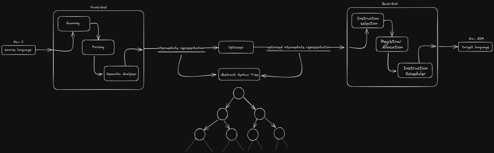

# Questão 3

**Quais são as principais etapas no processo de compilação?**

**Elabore a sua resposta com um diagrama de blocos. Explique qual a função de cada etapa e cada sub-bloco.*

Em uma estrutura de nível mais alto, temos a abstração representada no diagrama de blocos acima. Cada bloco e/ou sub-bloco representa uma abstração de processos menores necessários para atingir o ponto final, que é a tradução do código fonte inicial (L1) para a linguagem alvo desejada (L2), como, por exemplo, de C para Assembly (linguagem de máquina). Um compilador, como sabemos, atua essencialmente como um conversor.

Falando sobre o fluxo, apresentamos as seguintes descrições:

- **Source Language (ou Linguagem fonte):** representa a linguagem original (L1) a ser compilada;
- **Front-end:** este é o passo inicial crucial para a construção dos processos subsequentes. Realizamos análises e estruturação de dados para garantir o correto funcionamento dos processos seguintes. Este estágio é subdividido em três processos internos principais:
  - **Scanning:** estrutura a linguagem alvo em uma representação intermediária, classificando-a em tipos correspondentes e gerando o alfabeto a ser utilizado nos passos seguintes.
  - **Parsing:** verifica a estrutura capturada pelo scanning, identificando se a estrutura montada é esperada com base na classificação.
  - **Semantic Analyzer (Analisador Semântico):** no final do front-end, o analisador semântico verifica se a estrutura capturada e estruturada na representação intermediária construída nos passos anteriores é satisfatória. Nesta etapa, trabalhamos com um contexto mais detalhado.

- **Intermediate Representation (Representação Intermediária):** é uma estrutura montada pelo front-end para facilitar a captura de informações de cada elemento. Geralmente, utiliza-se uma estrutura de Árvore Sintática Abstrata.

- **Optimizer (Otimizador):** neste estágio de otimização, muitas vezes tratado como opcional, busca-se obter vantagens em termos de tempo e/ou espaço antes de passar para o back-end. Se ocorrer alguma otimização, obtemos uma representação intermediária otimizada na saída, geralmente uma AST.

- **Back-end:** finalmente, chegamos à etapa final do compilador. Após validar tudo o que era necessário e construir uma representação estruturada do que estamos buscando, podemos iniciar o processo de compilação propriamente dito. Utilizando a linguagem alvo, como o Assembly neste exemplo, podemos explicar as etapas da seguinte maneira:

  - **Instruction Selection (Seleção de instruções):** nesta etapa, ocorre a conversão efetiva entre o código fonte escrito e as instruções existentes na linguagem alvo, considerando registradores virtuais sem levar em conta as limitações físicas de hardware.

  - **Register Allocation (Alocação de registradores):** preocupamo-nos aqui com a alocação de registradores, mapeando os virtuais para físicos, saindo de uma representação infinita para uma limitada.

  - **Instruction Scheduler (Escalonador de instruções):** visando otimizar ainda mais o uso de memória e, em muitos casos, tempo, é realizada uma alocação de instruções. Ou seja, nessa etapa, teoricamente, tudo está pronto, mas as instruções são organizadas de maneira sequencial no momento da compilação. Este passo é responsável por definir a ordem de execução das instruções, visando ganhos de tempo ou espaço.

Ao final de todas as etapas, concluímos o processo de compilação. Assim, passamos de uma linguagem fonte (L1), como C, para uma linguagem alvo (L2), como Assembly.
