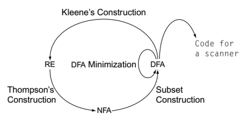

# Questão 5

**Discorra sobre a figura abaixo enfatizando o papel e a importância de cada uma das construções mencionadas para o projeto de um scanner.**

O scanner é um processo de extrema importância para construção de um compilador. Já na parte do front-end, como demonstrado em questões anteriores, temos a utilização dele. Seu principal objetivo é realizar uma separação do código fonte para, assim, classifica-los com base nas classes disponíveis para o compilador em questão. Seja um número, um identificador, uma função, e por ai vai. Sendo assim, existem muitos processos que devem ser realizados para que o scanner ocorra de forma desejada. O diagrama abaixo tenta demonstrar a sequencia clássica para esses processos:

Sendo assim, com base nesse diagrama, podemos notar que para a compreensão de todo o fluxo de um scanner é essencial compreender conceitos fundamentais, tais como Autômatos Finitos Determinísticos (AFD), Autômatos Finitos Não-Determinísticos (AFN), Expressões Regulares (ER) e Minimização de Autômatos Finitos Determinísticos.

Contudo, na construção de uma linguagem, frequentemente iniciamos com uma representação natural dela, sendo a escolha mais comum a expressão regular. Embora seja eficaz para operações e interpretações naturais, a expressão regular não é ideal, do ponto de vista algorítmico, para a implementação do scanner, que é nosso foco aqui. Para essa finalidade, necessitamos de um AFD. Até o momento da resolução dessa lista de exercícios, não existe um algoritmo convencionalmente utilizado para realizar essa conversão de forma totalmente automatizada. No entanto, podemos mais uma vez recorrer à matemática para abordar essa questão, e é aqui que entra o algoritmo de Thompson.

A partir de uma expressão regular, utilizamos o algoritmo de Thompson para realizar a conversão da ER para um NFA. Com o NFA em mãos, empregamos a construção de subconjuntos para transformar o AFN em um AFD. Agora, com o AFD, podemos prosseguir com o fluxo para a conclusão do scanner. No entanto, um passo intermediário é altamente recomendado: a minimização do AFD.

A minimização de um AFD é realizada para otimizar o desempenho do scanner, visando atingir o menor número possível de estados em um AFD equivalente ao obtido após a conversão do AFN para AFD. Esta minimização oferece diversas vantagens:

- **Economia de Espaço:** Reduz o número de estados do autômato, resultando em menos transições e, por conseguinte, economizando espaço de armazenamento, uma consideração crucial para implementações eficientes;
- **Melhoria de Performance:** Um AFD minimizado resulta em menos transições entre estados durante o reconhecimento de padrões, o que se traduz em desempenho mais eficiente durante a execução do scanner;
- **Simplificação da Lógica:** Um AFD minimizado é mais compreensível durante a implementação, eliminando redundâncias e simplificando a estrutura do autômato, tornando o código mais claro e compreensível.

Resumidamente, a minimização é crucial por vários motivos, principalmente para melhorar a compreensão do autômato e obter ganhos em termos de espaço, tempo e processamento.

Após essa otimização, podemos avançar efetivamente para a conclusão do scanner, que envolve a geração do código para representação intermediária em si, dando continuidade às próximas fases do front-end.

Vale ressaltar que, na imagem apresentada para essa questão, há uma transição não comentada e nem demonstrada no diagrama construído: a conversão de um AFD para uma ER. Essa transição pode ser útil para verificar se, após todas as conversões, obtemos também uma expressão regular equivalente. Entretanto, os passos para a construção de um scanner se encerram na minimização do AFD equivalente, uma vez que, se aplicado corretamente e de maneira automatizada e algorítmica, o processo de conversão não resultará em diferenças, sempre mantendo representações equivalentes.
