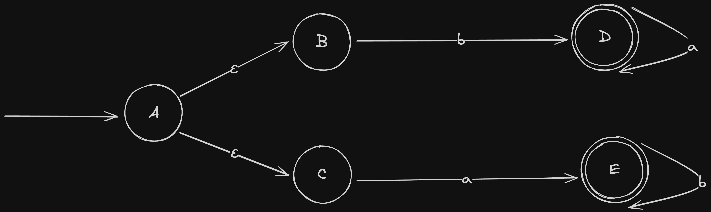
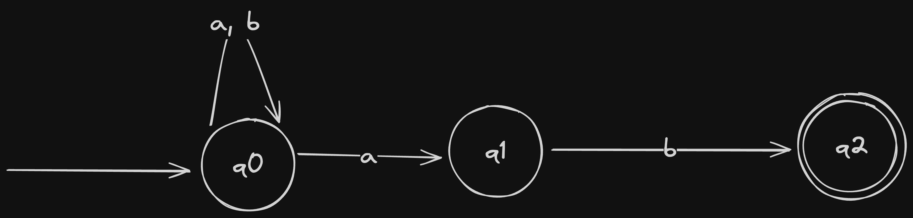
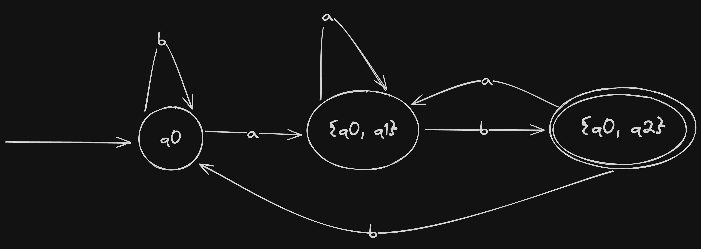

# Questão 6

**Apresente o algoritmo de Construção de Subconjuntos para transformação de um NFA em um DFA e explique seu funcionamento com um exemplo.**

Um conceito importante na teoria dos autômatos é o algoritmo de construção de subconjunto, que desempenha um papel significativo na conversão de um autômato finito não determinístico (`AFN`) em seu autômato finito determinístico equivalente (`DFA`). Seu objetivo é criar um `AFD` que simule o comportamento do AFN, permitindo cálculos determinísticos e previsíveis. Este algoritmo é crucial para converter `AFNs`, que são mais fáceis de construir, em `AFDs` que podem ser executados de forma mais eficiente.

Primeiramente precisamos elaborar o conceito `ε-fechamento(λ)`. É importante notar que `λ` pode ser um estado único, vários estados ou uma função de transição. Em um `AFN`, `ε-fechamento(λ)` é o conjunto de todos os estados que podem ser alcançados a partir de `λ` seguindo apenas `ε-transições` (transições com o vazio). Em outras palavras, é o conjunto de estados ativos a partir de um estado `λ`, inclusive.

Por exemplo, na figura acima, temos `ε-fechamento(A) = {A, B, C}` indicando que os estados `A`, `B` e `C`, estão **ativos**. Observe que, o algoritmo de construção de subconjunto usa este `ε-fechamento(S)`, sendo `S` o estado inicial do `NFA` fornecido, para encontrar o estado inicial do `AFD` desejado.

Em qualquer caso, para estados múltiplos, `ε-fechamento(A, E) = {A, B, C, E}` e `ε-fechamento(C, D) = {C, D}` temos simplesmente a união dos resultados de cada estado.

Um caso em particular é o que ocorre quando o elemento `λ` é uma função de transição e é utilizado para captura do `ε-fechamento(λ)`. Por exemplo, `ε-fechamento(δ(A, a)) = φ`; `ε-fechamento(δ(B, a)) = {D}` e `ε-fechamento(δ (C, a)) = φ`. Portanto, no `δ({A, B, C}, a) = φ ∪ {D} ∪ φ = {D}`. No algoritmo de construção de subconjunto, este `{D}` forma um novo estado.

Ao converter um `NFA` em `AFD`, não há garantia de que teremos um `AFD` menor. Em vez disso, o `AFD` resultante pode ter um número significativamente maior de estados, o que pode tornar o processo de construção inviável em alguns casos. Para ser mais específico, se o `NFA` consiste em `n` estados, o `DFA` resultante pode conter até `2^n` estados, um número que é exponencialmente maior. Dito isto, existem algoritmos que podem minimizar um `DFA` removendo estados e transições redundantes. Esse processo de minimização é especialmente essencial principalmente, como comentado anteriormente (*questão 5*), em processo de construção de um ***scanner***.

Abaixo está o processo completo de transformação do AFN em um AFD equivalente.

#### Formalização do AFN acima

|Parâmetro| Valor                  | Descrição                  |
|:--------|:-----------------------|:---------------------------|
|Q        | {q0, q1, q2}           | Conjunto de estados        |
|Σ        | {a, b}                 | Alfabeto                   |
|δ        | *Tabela abaixo*        | Função de Transição do AFN |
|q0       | q0                     | Estado inicial             |
|F        | {q2}                   | Conjunto de Estados Finais |

| δ  | a        | b    | ε-fechamento(λ) |
|----|----------|------|-----------------|
| q0 | {q0, q1} | {q0} | {q0}            |
| q1 |          | {q2} | {q1}            |
| q2 |          |      | {q2}            |

#### Tabela de transição do AFD equivalente

| δ        | a        | b        |
|----------|----------|----------|
| q0       | {q0, q1} | {q0}     |
| {q0, q1} | {q0, q1} | {q0, q2} |
| {q0, q2} | {q0, q1} | {q0}     |

*`Obs.: δn(λ, α) => E(δd(λ, α))`*

#### Sendo assim:

|Parâmetro| Valor                    | Descrição                  |
|:--------|:-------------------------|:---------------------------|
|Q        | {q0, {q0, q1}, {q0, q2}} | Conjunto de estados        |
|Σ        | {a, b}                   | Alfabeto                   |
|δ        | *Tabela acima*           | Função de Transição do AFD |
|q0       | q0                       | Estado inicial             |
|F        | {{q0, q2}}               | Conjunto de Estados Finais |