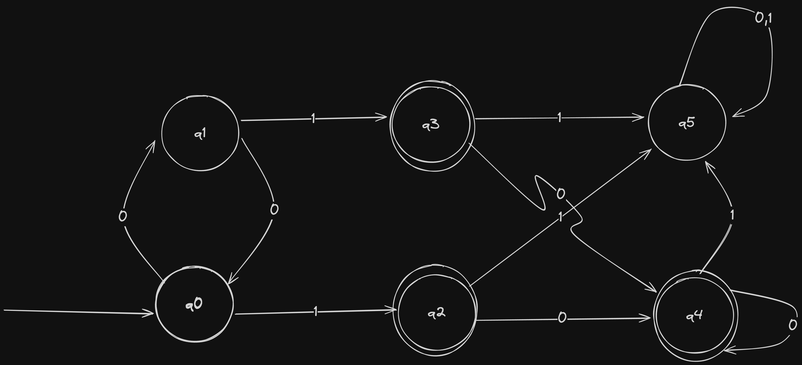
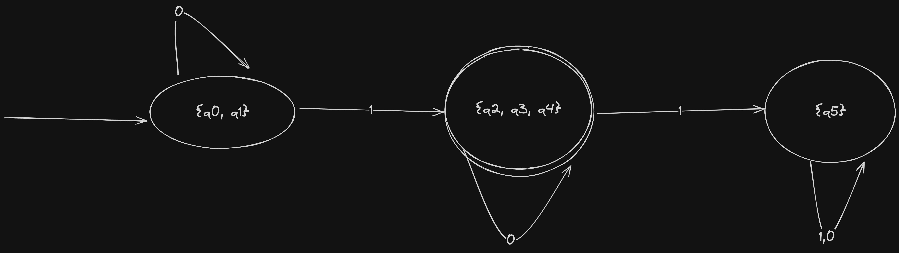

# Questão 7

**Explique, com um exemplo, como funciona a abordagem de minimização de um AFD.**

A minimização de um Automato Finito Determinístico (AFD) é, a partir de um determinado AFD, gerar um outro equivalente com um número mínimo de estados. A minimização de um AFD também pode ser chamada de Otimização de um AFD.

Supondo que exista um determinado AFD M abaixo definido pela 5-tupla (Q, Σ, q0, δ, F) que reconhece uma determinada linguagem L. Então o AFD minimizado/otimizado de M será (Q', Σ, q0, δ', F') obtido da seguinte forma:



Primeiramente obtemos uma matriz de estados.

| q0 |     |     |     |     |     |     |
|----|-----|-----|-----|-----|-----|-----|
| q1 |     |     |     |     |     |     |
| q2 |     |     |     |     |     |     |
| q3 |     |     |     |     |     |     |
| q4 |     |     |     |     |     |     |
| q5 |     |     |     |     |     |     |
|  - | q0  | q1  | q2  | q3  | q4  | q5  |

Agora, podemos reduzir consideravelmente a quantidade de elementos a se verificar se levarmos em consideração que a ordem não importa. Ou seja, o elemento na posição (`q0-linha`, `q5-coluna`) é o mesmo que (`q5-linha`, `q0-coluna`). Assim, toda uma sessão triangular (inferior ou superior) dessa matriz pode ser desconsiderada. Teremos o seguinte resultado:

| q0 | `-` | `-` | `-` | `-` | `-` | `-` |
|----|-----|-----|-----|-----|-----|-----|
| q1 |     | `-` | `-` | `-` | `-` | `-` |
| q2 |     |     | `-` | `-` | `-` | `-` |
| q3 |     |     |     | `-` | `-` | `-` |
| q4 |     |     |     |     | `-` | `-` |
| q5 |     |     |     |     |     | `-` |
|  - | q0  | q1  | q2  | q3  | q4  | q5  |

O próximo passo é identificar, com base nas transições desse automato, quais são estados possivelmente equivalentes ou não. Logo de cara podemos descartar a relação entre estados finais e não finais. Por exemplo:

* (`q0-linha`, `q5-coluna`), não sabemos o que se trata visto que os dois não são estados finais, então passamos para o próximo.
* (`q2-linha`, `q0-coluna`), temos certeza de que não são equivalentes pois um se trada de um estado final e outro não.

Utilizando essa lógica, percorremos toda a matriz e vamos preenchendo cada elemento com base na certeza de ser ou não equivalente. Assim, ficamos com a tabela abaixo:

| q0 |  -  |  -  |  -  |  -  |  -  |  -  |
|----|-----|-----|-----|-----|-----|-----|
| q1 |     |  -  |  -  |  -  |  -  |  -  |
| q2 | `X` | `X` |  -  |  -  |  -  |  -  |
| q3 | `X` | `X` |     |  -  |  -  |  -  |
| q4 | `X` | `X` |     |     |  -  |  -  |
| q5 |     |     | `X` | `X` | `X` |  -  |
|  - | q0  | q1  | q2  | q3  | q4  | q5  |

Com isso reduzimos consideravelmente a quantidade de elementos a serem verificados agora. 

Entretanto, não há mais o que fazer para reduzir a além de transicionar os estados faltantes com o alfabeto reconhecível pelo automato e tirarmos a dúvida verificando o estado resultante com base na tabela atual. Vamos lá!

Verificamos os estados da seguinte forma:

```sh
* δ(q0, q1) == 0 ==> (q1, q0)
* δ(q0, q1) == 1 ==> (q2, q3)
# ===========================
* δ(q0, q5) == 0 ==> (q1, q5)
* δ(q0, q5) == 1 ==> (q2, q5) ❌
# ===========================
* δ(q1, q5) == 0 ==> (q0, q5) ❌
* δ(q1, q5) == 1 ==> (q3, q5)
# ===========================
* δ(q2, q3) == 0 ==> (q4, q4)
* δ(q2, q3) == 1 ==> (q5, q5) 
# ===========================
* δ(q2, q4) == 0 ==> (q4, q4)
* δ(q2, q4) == 1 ==> (q5, q5)
# ===========================
* δ(q3, q4) == 0 ==> (q4, q4)
* δ(q3, q4) == 1 ==> (q5, q5)
```

Sendo assim:

| q0 |  -  |  -  |  -  |  -  |  -  |  -  |
|----|-----|-----|-----|-----|-----|-----|
| q1 |     |  -  |  -  |  -  |  -  |  -  |
| q2 |  X  |  X  |  -  |  -  |  -  |  -  |
| q3 |  X  |  X  |     |  -  |  -  |  -  |
| q4 |  X  |  X  |     |     |  -  |  -  |
| q5 | `X` | `X` |  X  |  X  |  X  |  -  |
|  - | q0  | q1  | q2  | q3  | q4  | q5  |

